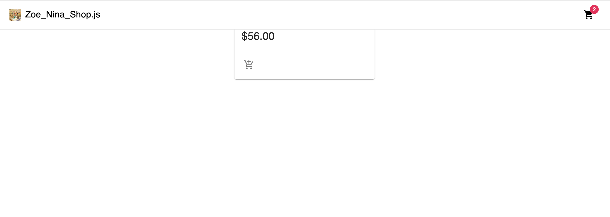

# E-Commerce Store using React Native
### Zoe Wortzman and Nina Paripovic

## What you built? 

We built a web page for e-commerce using React Native.

Include some screenshots.

## Who Did What?

We took turns with building certain components. Nina set up the initial structure and created the Products page. Zoe worked on the navigation bar and linking it to the API.

## What you learned

Once we learnt the general pattern of how functional components work, it was fairly easy to add additional components. However, the initial syntax was a bit difficult to understand. We also had issues with the API and found online documentation and troubleshooting difficult to follow.

## Authors

Zoe Wortzman
Nina Paripovic

## Acknowledgments

Youtube tutorial: https://youtu.be/377AQ0y6LPA 
